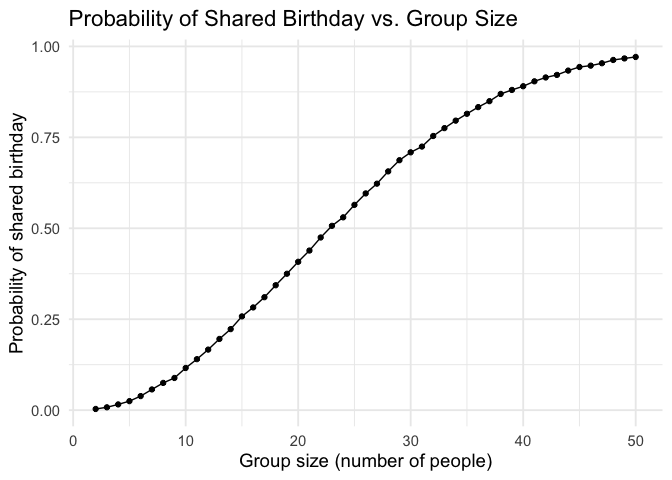
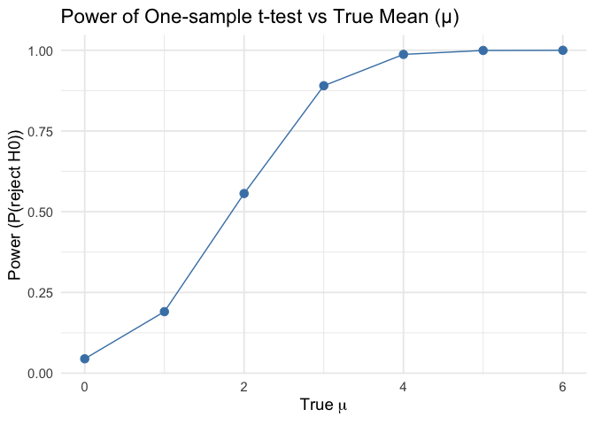
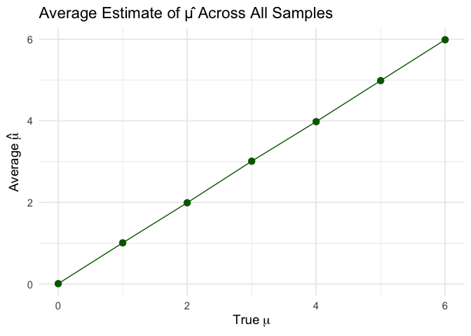
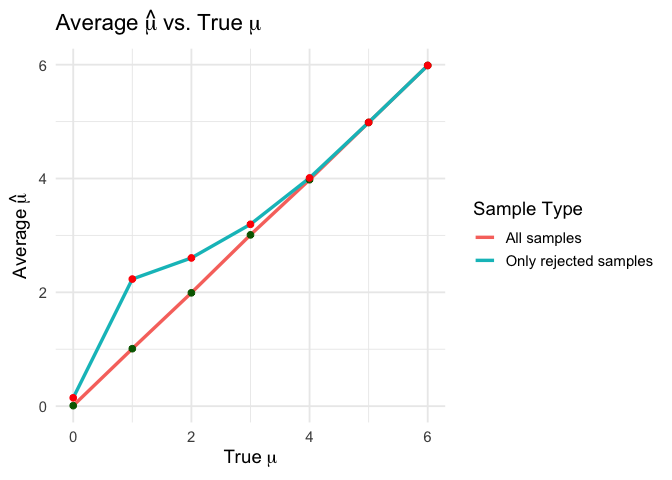
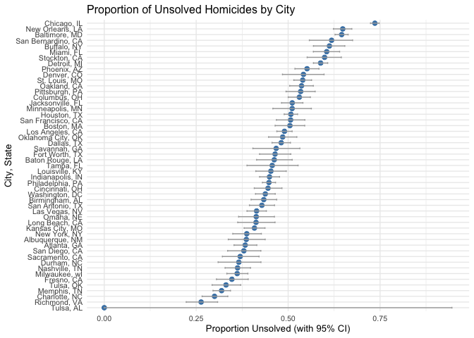

p8105_hw5_cc5424
================
ChuqiChen
2025-11-13

``` r
library(tidyverse)
```

    ## ── Attaching core tidyverse packages ──────────────────────── tidyverse 2.0.0 ──
    ## ✔ dplyr     1.1.4     ✔ readr     2.1.5
    ## ✔ forcats   1.0.0     ✔ stringr   1.5.1
    ## ✔ ggplot2   3.5.2     ✔ tibble    3.3.0
    ## ✔ lubridate 1.9.4     ✔ tidyr     1.3.1
    ## ✔ purrr     1.1.0     
    ## ── Conflicts ────────────────────────────────────────── tidyverse_conflicts() ──
    ## ✖ dplyr::filter() masks stats::filter()
    ## ✖ dplyr::lag()    masks stats::lag()
    ## ℹ Use the conflicted package (<http://conflicted.r-lib.org/>) to force all conflicts to become errors

\#problem1

``` r
birthdays = sample(1:365, 5, replace = TRUE)

repeated_bday = length(unique(birthdays)) < 5

repeated_bday
```

    ## [1] FALSE

``` r
bday_sim = function(n_room) {
  
  birthdays = sample(1:365, n_room, replace = TRUE)

  repeated_bday = length(unique(birthdays)) < n_room

  repeated_bday
  
}

bday_sim(20)
```

    ## [1] FALSE

``` r
set.seed(123)

bday_sim_results = 
  expand_grid(
    bdays = 2:50, 
    iter = 1:10000
  ) |>
  mutate(
    result = map2_lgl(bdays, iter, ~ bday_sim(.x))
  ) |>
  group_by(bdays) |>
  summarize(prob_repeat = mean(result))
```

``` r
bday_sim_results |> 
  ggplot(aes(x = bdays, y = prob_repeat)) + 
  geom_point() + 
  geom_line() +
  labs(
    title = "Probability of Shared Birthday vs. Group Size",
    x = "Group size (number of people)",
    y = "Probability of shared birthday"
  ) +
  theme_minimal(base_size = 14)
```

<!-- -->
Comment: The probability increases rapidly with group size, exceeding
50% when n ≈ 23, illustrating the well-known birthday paradox.

\#problem2

``` r
# "Fix n = 30" 和 "Fix σ = 5"

n = 30
sigma = 5

# "Set μ = 0. Generate 5000 datasets from the model x ~ Normal[μ, σ]"

set.seed(123)
library(tidyverse)
library(broom)

simulate_ttest = function(mu) {

replicate(5000, {
x = rnorm(n, mean = mu, sd = sigma)
test = t.test(x, mu = 0)
res = broom::tidy(test)
tibble(
mu_true = mu,
mu_hat = mean(x),
p_value = res$p.value
)
}, simplify = FALSE) |> bind_rows()
}

# "Repeat the above for μ = {1, 2, 3, 4, 5, 6}"

mu_values = 0:6
sim_results = map_df(mu_values, simulate_ttest)

# "Make a plot showing the proportion of times the null was rejected (the power of the test)
# on the y axis and the true value of μ on the x axis."

power_results = sim_results |>
group_by(mu_true) |>
summarize(power = mean(p_value < 0.05))

ggplot(power_results, aes(x = mu_true, y = power)) +
geom_point(size = 3, color = "steelblue") +
geom_line(color = "steelblue") +
labs(
title = "Power of One-sample t-test vs True Mean (μ)",
x = expression(True~mu),
y = "Power (P(reject H0))"
) +
theme_minimal(base_size = 14)
```

<!-- -->

``` r
# "Make a plot showing the average estimate of μ̂ on the y axis and the true value of μ on the x axis."

avg_mu_all = sim_results |>
group_by(mu_true) |>
summarize(mean_mu_hat = mean(mu_hat))

ggplot(avg_mu_all, aes(x = mu_true, y = mean_mu_hat)) +
geom_point(size = 3, color = "darkgreen") +
geom_line(color = "darkgreen") +
labs(
title = "Average Estimate of μ̂ Across All Samples",
x = expression(True~mu),
y = expression(Average~hat(mu))
) +
theme_minimal(base_size = 14)
```

<!-- -->

``` r
# "Make a second plot (or overlay on the first) the average estimate of μ̂
# only in samples for which the null was rejected."

avg_mu_reject = sim_results |>
filter(p_value < 0.05) |>
group_by(mu_true) |>
summarize(mean_mu_hat_reject = mean(mu_hat))

combined_avg = left_join(avg_mu_all, avg_mu_reject, by = "mu_true")

ggplot(combined_avg, aes(x = mu_true)) +
geom_line(aes(y = mean_mu_hat, color = "All samples"), size = 1.2) +
geom_line(aes(y = mean_mu_hat_reject, color = "Only rejected samples"), size = 1.2) +
geom_point(aes(y = mean_mu_hat), color = "darkgreen", size = 2) +
geom_point(aes(y = mean_mu_hat_reject), color = "red", size = 2) +
labs(
title = expression(Average~hat(mu)~vs.~True~mu),
x = expression(True~mu),
y = expression(Average~hat(mu)),
color = "Sample Type"
) +
theme_minimal(base_size = 14)
```

    ## Warning: Using `size` aesthetic for lines was deprecated in ggplot2 3.4.0.
    ## ℹ Please use `linewidth` instead.
    ## This warning is displayed once every 8 hours.
    ## Call `lifecycle::last_lifecycle_warnings()` to see where this warning was
    ## generated.

<!-- -->

``` r
# "Is the sample average of μ̂ across tests for which the null is rejected approximately equal to the true value of μ? Why or why not?"

# Across all samples, the average estimate μ̂ ≈ true μ (unbiased).
# However, for samples where the null is rejected, μ̂ tends to be larger in magnitude
# because only extreme sample means yield small p-values.
# Therefore, conditional on rejection, μ̂ is biased upward (selection bias).
```

\#problem3

``` r
# 1"Describe the raw data."

library(tidyverse)
library(broom)

homicide_data = read_csv("data/homicide-data.csv")
```

    ## Rows: 52179 Columns: 12
    ## ── Column specification ────────────────────────────────────────────────────────
    ## Delimiter: ","
    ## chr (9): uid, victim_last, victim_first, victim_race, victim_age, victim_sex...
    ## dbl (3): reported_date, lat, lon
    ## 
    ## ℹ Use `spec()` to retrieve the full column specification for this data.
    ## ℹ Specify the column types or set `show_col_types = FALSE` to quiet this message.

``` r
glimpse(homicide_data)
```

    ## Rows: 52,179
    ## Columns: 12
    ## $ uid           <chr> "Alb-000001", "Alb-000002", "Alb-000003", "Alb-000004", …
    ## $ reported_date <dbl> 20100504, 20100216, 20100601, 20100101, 20100102, 201001…
    ## $ victim_last   <chr> "GARCIA", "MONTOYA", "SATTERFIELD", "MENDIOLA", "MULA", …
    ## $ victim_first  <chr> "JUAN", "CAMERON", "VIVIANA", "CARLOS", "VIVIAN", "GERAL…
    ## $ victim_race   <chr> "Hispanic", "Hispanic", "White", "Hispanic", "White", "W…
    ## $ victim_age    <chr> "78", "17", "15", "32", "72", "91", "52", "52", "56", "4…
    ## $ victim_sex    <chr> "Male", "Male", "Female", "Male", "Female", "Female", "M…
    ## $ city          <chr> "Albuquerque", "Albuquerque", "Albuquerque", "Albuquerqu…
    ## $ state         <chr> "NM", "NM", "NM", "NM", "NM", "NM", "NM", "NM", "NM", "N…
    ## $ lat           <dbl> 35.09579, 35.05681, 35.08609, 35.07849, 35.13036, 35.151…
    ## $ lon           <dbl> -106.5386, -106.7153, -106.6956, -106.5561, -106.5810, -…
    ## $ disposition   <chr> "Closed without arrest", "Closed by arrest", "Closed wit…

``` r
summary(homicide_data)
```

    ##      uid            reported_date       victim_last        victim_first      
    ##  Length:52179       Min.   : 20070101   Length:52179       Length:52179      
    ##  Class :character   1st Qu.: 20100318   Class :character   Class :character  
    ##  Mode  :character   Median : 20121216   Mode  :character   Mode  :character  
    ##                     Mean   : 20130899                                        
    ##                     3rd Qu.: 20150911                                        
    ##                     Max.   :201511105                                        
    ##                                                                              
    ##  victim_race         victim_age         victim_sex            city          
    ##  Length:52179       Length:52179       Length:52179       Length:52179      
    ##  Class :character   Class :character   Class :character   Class :character  
    ##  Mode  :character   Mode  :character   Mode  :character   Mode  :character  
    ##                                                                             
    ##                                                                             
    ##                                                                             
    ##                                                                             
    ##     state                lat             lon          disposition       
    ##  Length:52179       Min.   :25.73   Min.   :-122.51   Length:52179      
    ##  Class :character   1st Qu.:33.77   1st Qu.: -96.00   Class :character  
    ##  Mode  :character   Median :38.52   Median : -87.71   Mode  :character  
    ##                     Mean   :37.03   Mean   : -91.47                     
    ##                     3rd Qu.:40.03   3rd Qu.: -81.76                     
    ##                     Max.   :45.05   Max.   : -71.01                     
    ##                     NA's   :60      NA's   :60

The raw homicide dataset from The Washington Post contains one record
per homicide case. Each row represents a victim. The main variables
include: uid: unique case identifier (e.g., “Alb-000001”) reported_date:
numeric date (YYYYMMDD) when the homicide was reported victim_last,
victim_first: last and first name of the victim victim_race: recorded
race of the victim victim_age: age of the victim victim_sex: sex of the
victim (“Male”/“Female”/“Unknown”) city, state: location of the homicide
lat, lon: latitude and longitude coordinates disposition: final status
of the case, e.g.”Closed by arrest” “Closed without arrest” “Open/No
arrest” Each record therefore describes the victim’s demographic
information and whether the case was solved or remains unsolved.

``` r
# 2"Create a city_state variable (e.g. 'Baltimore, MD')"

homicide_data = homicide_data |>
mutate(city_state = paste(city, state, sep = ", "))

# 3"Summarize within cities to obtain the total number of homicides and the number of unsolved homicides (disposition is 'Closed without arrest' or 'Open/No arrest')."

homicide_summary = homicide_data |>
group_by(city_state) |>
summarize(
total = n(),
unsolved = sum(disposition %in% c("Closed without arrest", "Open/No arrest"))
)

head(homicide_summary)
```

    ## # A tibble: 6 × 3
    ##   city_state      total unsolved
    ##   <chr>           <int>    <int>
    ## 1 Albuquerque, NM   378      146
    ## 2 Atlanta, GA       973      373
    ## 3 Baltimore, MD    2827     1825
    ## 4 Baton Rouge, LA   424      196
    ## 5 Birmingham, AL    800      347
    ## 6 Boston, MA        614      310

``` r
# 4"For the city of Baltimore, MD, use prop.test to estimate the proportion of homicides that are unsolved; save the output of prop.test as an R object, apply broom::tidy, and pull the estimated proportion and confidence intervals."

baltimore = homicide_summary |>
filter(city_state == "Baltimore, MD")

baltimore_test = prop.test(baltimore$unsolved, baltimore$total)
baltimore_tidy = broom::tidy(baltimore_test)

baltimore_est = baltimore_tidy |>
select(estimate, conf.low, conf.high)

baltimore_est
```

    ## # A tibble: 1 × 3
    ##   estimate conf.low conf.high
    ##      <dbl>    <dbl>     <dbl>
    ## 1    0.646    0.628     0.663

``` r
# 5"Now run prop.test for each of the cities in your dataset, and extract both the proportion of unsolved homicides and the confidence interval for each."

city_results = homicide_summary |>
mutate(
test = map2(unsolved, total, ~ prop.test(.x, .y) |> broom::tidy())
) |>
unnest(test) |>
select(city_state, estimate, conf.low, conf.high)
```

    ## Warning: There was 1 warning in `mutate()`.
    ## ℹ In argument: `test = map2(unsolved, total, ~broom::tidy(prop.test(.x, .y)))`.
    ## Caused by warning in `prop.test()`:
    ## ! Chi-squared approximation may be incorrect

``` r
# 6"Create a plot that shows the estimates and CIs for each city – check out geom_errorbar for a way to add error bars based on the upper and lower limits. Organize cities according to the proportion of unsolved homicides."

city_results = city_results |>
arrange(desc(estimate)) |>
mutate(city_state = fct_reorder(city_state, estimate))

ggplot(city_results, aes(x = city_state, y = estimate)) +
geom_point(color = "steelblue", size = 2) +
geom_errorbar(aes(ymin = conf.low, ymax = conf.high), width = 0.3, color = "darkgray") +
coord_flip() +
labs(
title = "Proportion of Unsolved Homicides by City",
x = "City, State",
y = "Proportion Unsolved (with 95% CI)"
) +
theme_minimal(base_size = 14)
```

<!-- -->

``` r
# 7Describe findings.
# The proportion of unsolved cases varies significantly across cities.
# Certain cities (e.g., Baltimore) exhibit exceptionally high rates of unsolved cases.
# Error bars (95% CI) indicate the uncertainty in the estimates.
```
